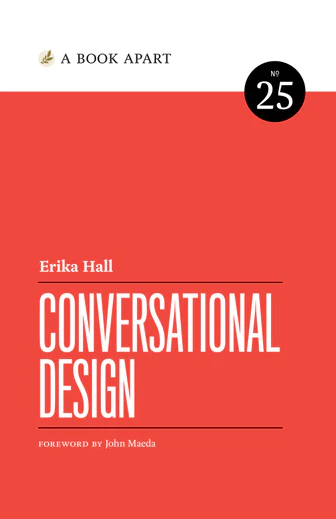

# Writing for Product Teams

Statewide IT 2024 Workshop

Chris Basham

Notes:
Welcome everyone to this workshop. The words we use and how we use them in apps and websites should solve problems, not create them. Today, we will learn through practical exercises how to make content purposeful, concise, clear, and inclusive. You'll come away with strategies to integrate user experience writing principles and practices into your team's iterative process. First, let's start with some background and logistics.

## Chris Basham

csbasham@iu.edu

UX designer in Enterprise Systems.

*Accessibility. Front-end dev. Design systems.*

Notes:
I'm Chris Basham. I've worked at Indiana University since 2012, as a UX designer and front-end developer, working on various web software products. Today, I want to share with you a topic I've been studying and practicing over the last couple years.

## Resources

https://github.com/basham/swit-workshop-writing

Notes:
All resources for this workshop, including slides, slide notes, and links, are located on GitHub. This link is posted in the Zoom chat.

## Zoom etiquette

- Raise your hand.
- Submit questions in chat.
- Mute when you're not talking.

Notes:
If you have any questions at any time, please use Zoom to raise your hand or post questions in the Zoom chat. If you're not talking, please mute your microphone.

# UX writing

Words that solve problems

## "We need words"

> …is not the problem that we solve as UX writers. We
communicate. We invite action. We inspire loyalty. Our teams need to
know that UX writing can be used to solve problems.

— *Strategic Writing for UX*

## Words should be…

1. Useful (why)
2. Usable (how, what)
3. Responsible (when, who)

## Process

Editing

## Iterative

> Writing UX text is iterative, starting with less-than-perfect words, then
replacing those words with slightly better words, and repeating until
you find the best words. This is the way to make the text purposeful
and protective, but also concise, conversational, and recognizable as
coming from the organization’s brand.

— *Strategic Writing for UX*

## Make writing…

1. Conversational
2. Concise (usable)
3. Clear (usable)
4. Inclusive (responsible)
5. Human

Notes:
…

# Make writing useful

Part 1 of 3

Notes:
Writing should be useful.

## Goal-oriented

Help both people and systems meet their goals

> - Person reads The Home Depot's [*How to Hang Drywall* guide](https://www.homedepot.com/c/ah/how-to-hang-drywall/9ba683603be9fa5395fab90cbb4826d).
> - Person purchases related products.

Notes:
Words that are useful serve a purpose. In product design, that purpose should be to help people and systems meet their goals and solve their problems.

Second, the system should be goal-oriented. Both the person and the system should be able to meet their own goals. For example, a home owner wants to hang drywall for the first time. This requires knowledge, materials, and tools. They discover Home Depot has a guide to walk through this project with videos and written instructions. They've gained knowledge, but the page also lists the materials and tools that they may need. These product pages then display the aisle and bay that they are located in the customer's local store. In summary, the store aims to gain a loyal customer (and their money) by making it easy for the customer to learn about and complete their projects.

## (Not goal-oriented)

One-sided or no-sided

> - 

Notes:
What experiences have you had (goal-oriented or not goal-oriented)?

## Cooperation

Work together to meet individual goals

Notes:
Many goals can't be solved alone. It requires cooperation. People and systems must work together, so they can meet their individual goals.

## Cooperative

Reduce required effort and upfront knowledge

> - **Waiter:** Would you like wheat bread or gluten-free bread?
> - **Customer:** Wheat, please.
> - **Waiter:** Great.

Notes:
First, the system should be cooperative. It should reduce the amount of effort or upfront knowledge that a user needs. In this example, the waiter says, "Would you like wheat bread or gluten-free bread?" The customer responds, "Wheat, please." The waiter confirms, "Great." In this case, the waiter states upfront the options available to the customer. The customer can provide a simple response by selecting one of those options.

## (Not cooperative)

Requires effort or upfront knowledge

> - **Customer:** Can you call me when this table is back in stock?
> - **Furniture rep:** No.
> - **Customer:** Then what should I do?
> - **Furniture rep:** Check back later.

Notes:
In contrast, an exchange could be not cooperative. In this example, a customer asks, "Can you call me when this table is back in stock?" The representative of furniture company replies bluntly, "No." The rep does not offer any further options. This requires the customer to follow up with, "Then what should I do?" The rep coldly replies, "Check back later." This unhelpful exchange was frustrating for the customer, and it will demand even more of their time and effort, if they really want that table.

What experiences have you had (cooperative or not cooperative)?

## Meaningful exchange

Information or resources

Notes:
Cooperation is a give and take. It is a meaningful exchange of information or resources.

## Exchange with a system

Person ⇄ (Interface) ⇄ System

Notes:
Exchange happens between a person and a system through a user interface.

## Exchange with a person

Person ⇄ (Conversation) ⇄ Person

Notes:
A more common form of this meaningful exchange happens when two people engage in a conversation. We can use our experience talking with other people as a guide for the writing we use in our digital systems.

## Exercise

Have a meaningful conversation

1. Select situation and roles.
2. Write down goals for your role.
3. Select principle or anti-principle.
4. Role-play the conversation.
5. Write down as text message exchange.
6. Build a user journey.
7. Build wireframes.

## Situations

1. Customer orders pizza for delivery.
2. Customer schedules haircut.
3. Customer calls customer service about broken microwave.
4. Customer talks with post office rep about a missing package.
5. Friend invites you to their birthday party.
6. Friend asks you to care for their pet this weekend.

## Customer orders pizza for delivery.

1. Rep fails to explain options.
2. Rep gives incorrect delivery time.
3. Customer gives incorrect credit card number.

# Make writing usable

Part 2 of 3

## Conversational Design

Erika Hall (2018)

Notes:
In the book Conversational Design, Erika Hall outlines eight design principles we can follow to make our digital systems more conversational.

## Design principles

1. Cooperative (useful)
2. Goal-oriented (useful)
3. Context-aware (responsible)
4. Quick and clear (usable)
5. Turn-based (usable)
6. Truthful (responsible)
7. Polite (responsible)
8. Error-tolerant (responsible)

Notes:
According to these principles, a conversation with an interface or digital system should be: cooperative, goal-oriented, context-aware, quick and clear, turn-based, truthful, polite, and error-tolerant. I'll go through each of these in more detail, with examples. I will also invite you to share any relevant experiences you've had.

## 3. Context-aware

Sensitive to time, place, preferences

> **Phone notification:** Would you like to automatically turn on Silent Mode when you arrive at the movie theater?

Notes:
Third, the system should be context-aware. It should be sensitive to circumstances, such as time of day, location of the user, and any preferences the user has set. For example, a person's phone may be aware that they are going to a movie theater this evening, according to their calendar. Before leaving, the phone asks if silent mode should be turned on once they arrive, in order to avoid disturbing others during the movie.

## (Not context-aware)

Generic, insensitive, assumptions

> **Email:** Exciting news! You have been invited to "Celebrating the life of Jack." RSVP now!

Notes:
In contrast, a system can cause emotional distress if it does not tailor messaging for the situation. For example, an event platform that assumes that all events are a joyous occasion is insensitive to situations like a memorial arranged for friends and family of someone who recently died.

https://cloudfour.com/thinks/handling-death-gracefully-in-digital-experiences/

What experiences have you had (context-aware or not context-aware)?

## 4. Quick and clear

To the point

> **Alert:** Document saved

Notes:
Fourth, a system should be quick and clear with its messaging. For example, after the user saves a document, an alert displays that just states, "Document saved." That's sufficient to inform the person that they're not going to lose their progress.

## (Not quick and clear)

Ambiguous

> **Alert:** System Error 5023

Notes:
In contrast, something that is ambiguous is not quick and clear. The user could encounter an alert that displays an error code. This code has no meaning to the user. The message doesn't inform them what happened or didn't happen, or what they should do next or not do next. This creates confusion, raises stress, and wastes time.

What experiences have you had (quick and clear or not quick and clear)?

## 5. Turn-based

Clarity regarding who should respond

> - **A:** What is your position? Over.
> - **B:** Two clicks south. Over.
> - **A:** Proceed as planned. Over and out.

Notes:
Fifth, a system should be turn-based. It should be made clear when one party is done responding and ready to receive a reply. For example, procedure words are special instructions people use for radio communication. Ending a response with "Over" is a quick and respectful way to mean that the person is done talking but they are waiting and listening for a rely. "Over and out" means the person is done listening.

https://en.wikipedia.org/wiki/Procedure_word

## (Not turn-based)

Monologues or interruptions

> - **A:** (Rambling…)
> - **B:** Excuse me…
> - **A:** (Still rambling…)
> - **B:** Can I just…
> - **A:** (Rambling continues…)

Notes:
In contrast, when there is no space for responses, one party can dominate. This means the dialog is actually a monologue. A person wanting to have a conversation may be forced to interrupt the other who may just be rambling.

What experiences have you had (turn-based or not turn-based)?

## 6. Truthful

Credible, verifiable, not confusing

> **Email from charity:**  
> Thank you for donating! We will email you quarterly reports detailing how your money is benefiting the cause.

Notes:
Sixth, a system should be truthful. What it says should be credible, verifiable, and not confusing. For example, a person who just donated to a charity received an email. It states, "Thank you for donating! We will email you quarterly reports detailing how your money is benefiting the cause." The message confirms the donation, but it also provides a way for the person to verify that the donation will be used as they intended. This gives the person confidence, which encourages them to continue their relationship with the charity.

## (Not truthful)

Expectation does not meet reality

> - **Note from ISP:** Sorry we missed you! Call this number to talk with us.
> - **Customer:** (Calls phone number.) Is this my internet service provider?
> - **Person called:** Why am I still getting these calls!? Wrong number!

Notes:
In contrast, a system is not truthful if the expectation does not align with reality. In this example, a customer could not immediately respond to a knock on the door. The technician they were expecting left a note that printed a phone number to call. The customer calls it, but instead of reaching anyone associated with the service provider, it called an unrelated personal phone number. The printed phone number was incorrect, and has been incorrect for months. This typo has made it frustrating for both you and this other person.

What experiences have you had (truthful or not truthful)?

## 7. Polite

Respect time, anticipate needs

> 

## (Not polite)

Wastes time, rude

> - **Popup:** Spin this wheel to win!
> - **Person:** I'm just trying to read this article! I can't find the close button!

## 8. Error-tolerant

Anticipates errors, recovers seamlessly

> - **A:** Turn right on Main St in two blocks.
> - **B:** Main St is in three blocks. Is the turn at Main St or in three blocks?

## (Not error-tolerant)

> - Technician arrives early, while customer is returning home.
> - Knocks on door, to no answer.
> - Leaves before appointment time.

Notes:
In contrast, a system is not error-tolerant if the expectation does not align with reality. In this example, a customer arrived home a couple minutes before a technician from their internet service provider was scheduled to arrive. They read a note on their door claiming the technician a

# Part 2

Make writing concise

Notes:
…

## Iteration

Replace words with better words
Repeat
Editing

## Omit needless words

## Omit needless information

## Precision

Precision tends to be wordy.
Progressively reveal content with disclosures or links to other pages.

## Line length

50 characters words line
1–4 lines long

## Buttons, badges

1–3 words

# Part 3

Make writing clear

Notes:
…

## Consistency

Just like how conciseness has tension with precision, clarity has tension with consistency. Prioritize clarity over consistency.

# Part 4

Make writing inclusive

Notes:
…

# Part 5

Make writing human

Notes:
…

# Thank you

https://github.com/basham/swit-workshop-impact

Notes:
Once again, the slides and additional resources are on GitHub. Feel free to follow up with me as you need. Thank you for joining me today.
